# Employee Management System

## 📸 Screenshot Gallery

 
 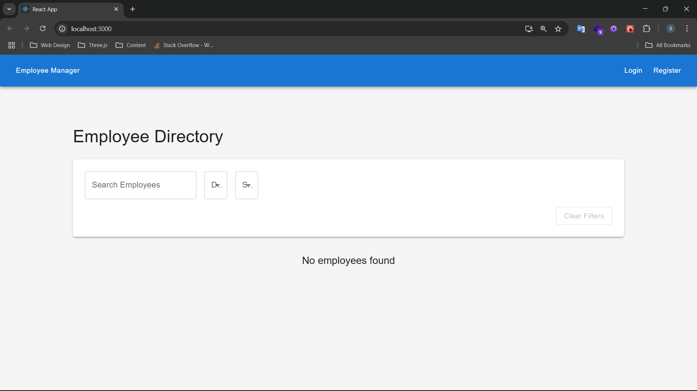
 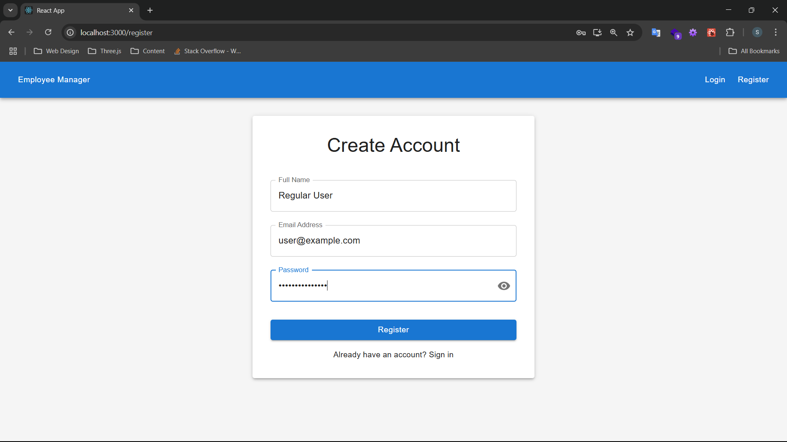
 
 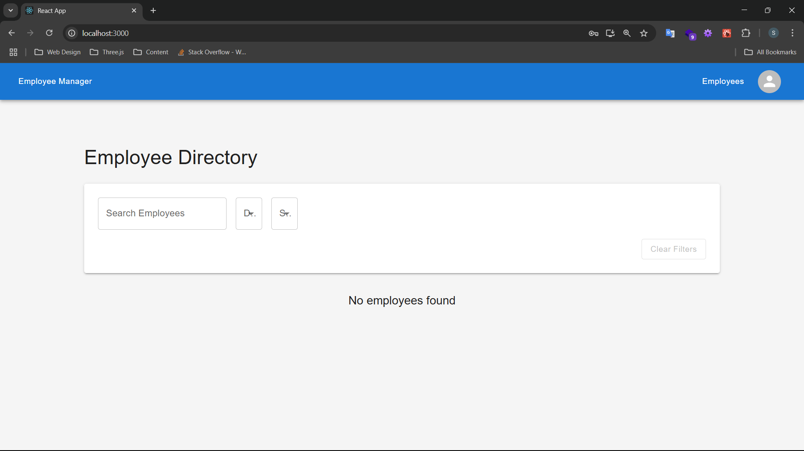
 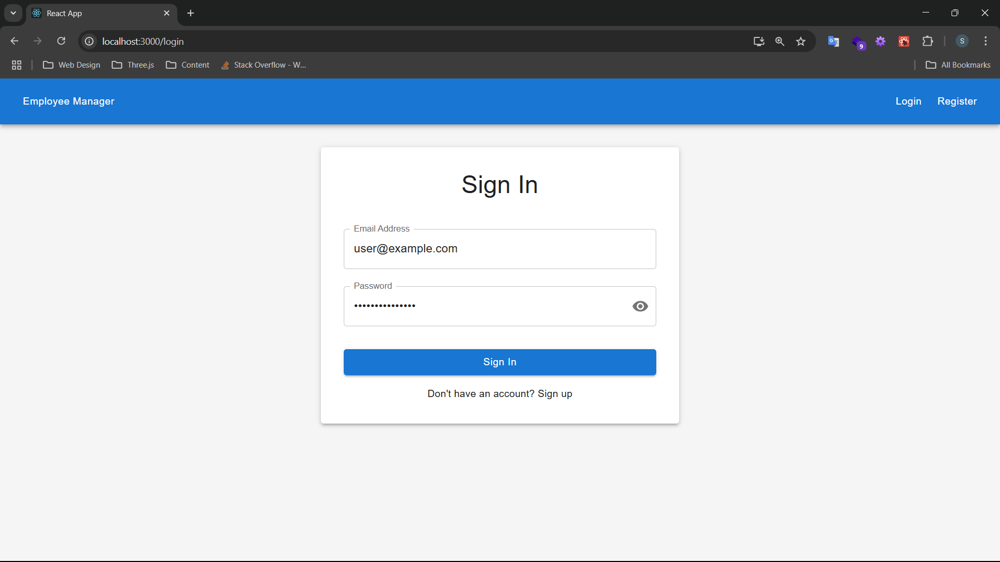
 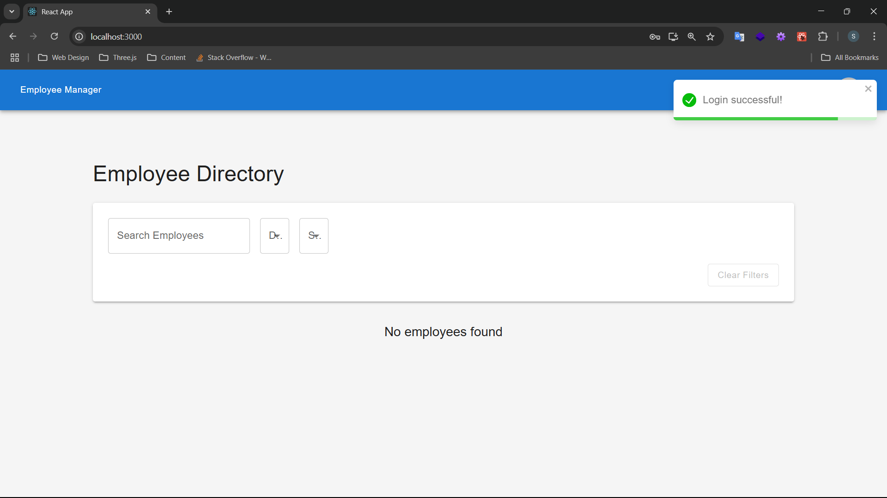
 
 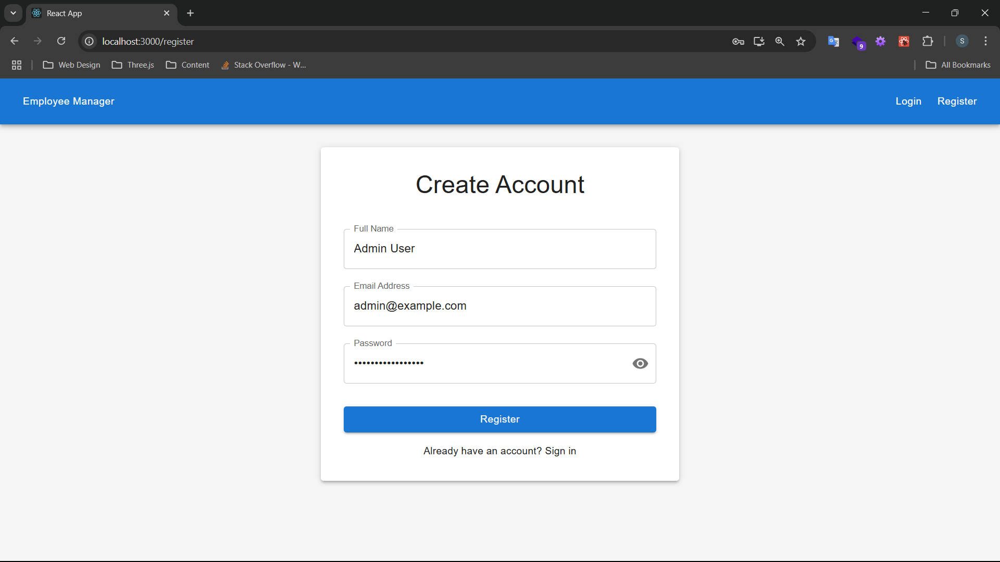
 
 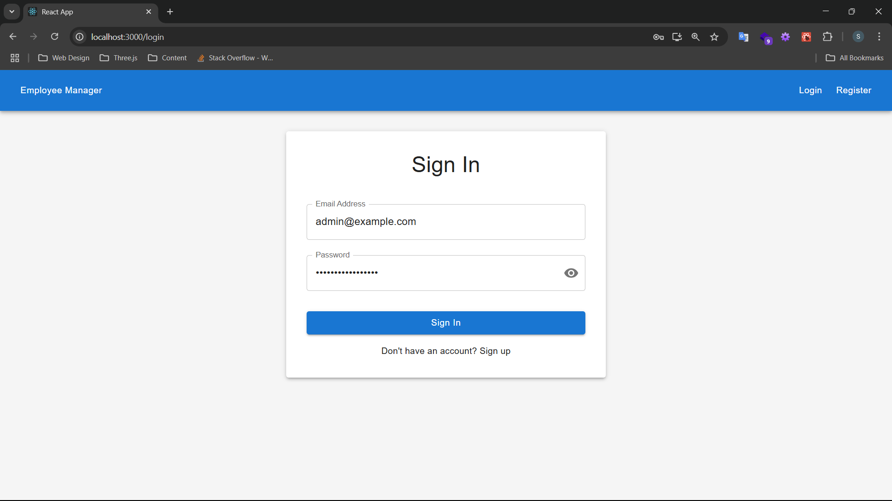
 
 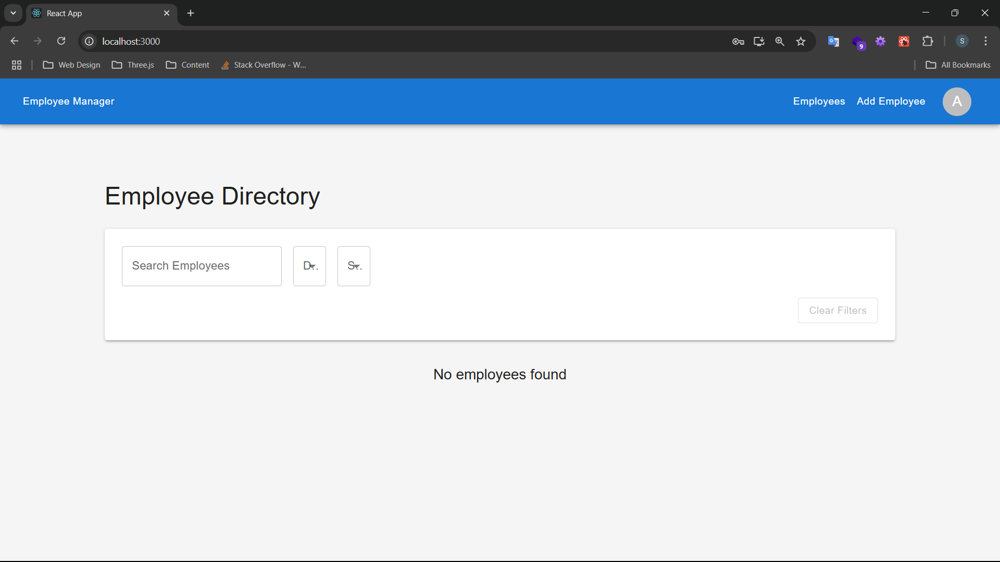
 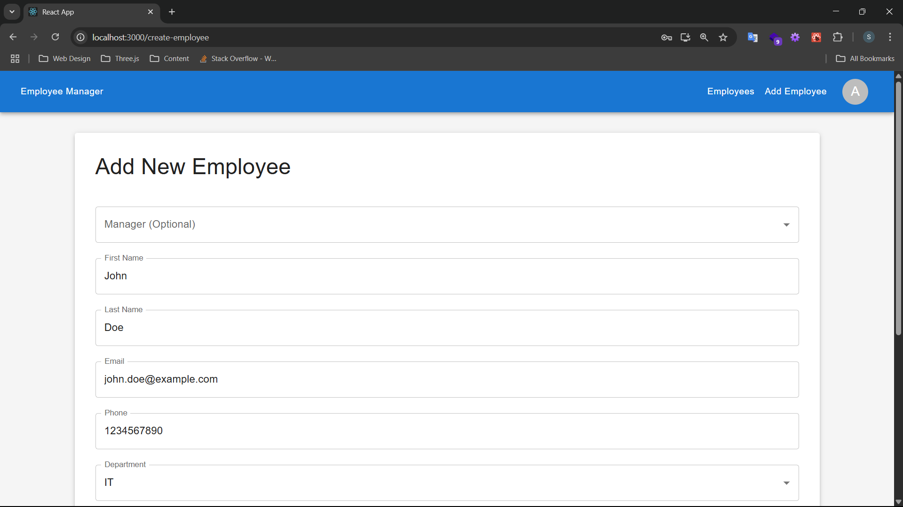
 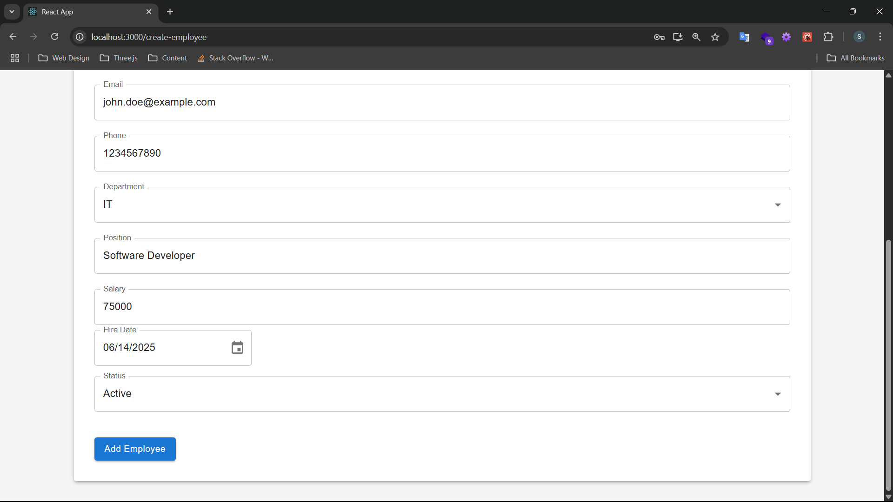
 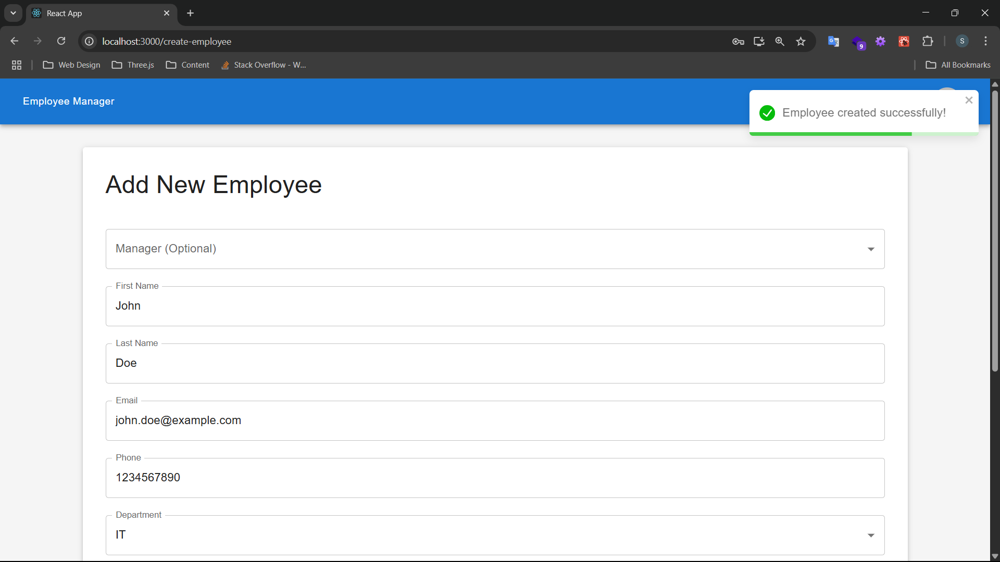
 
 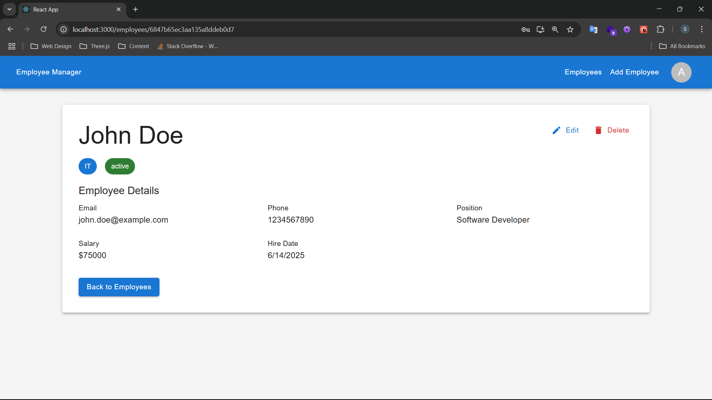
 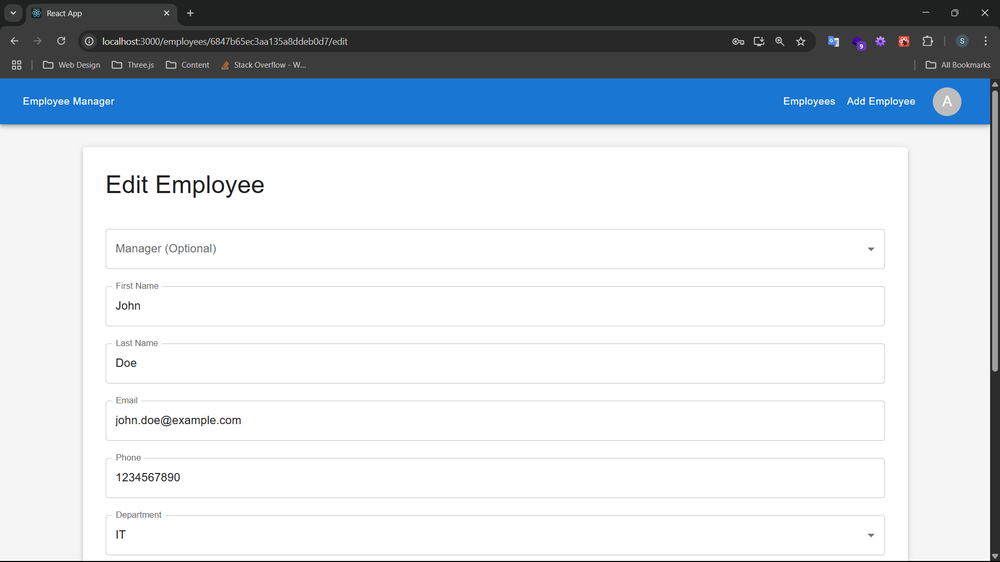
 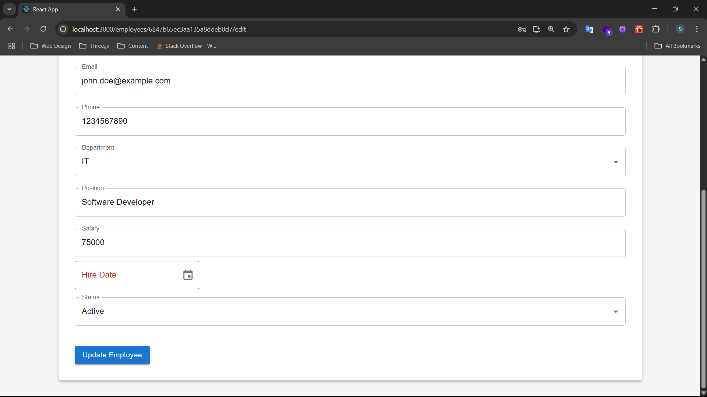
 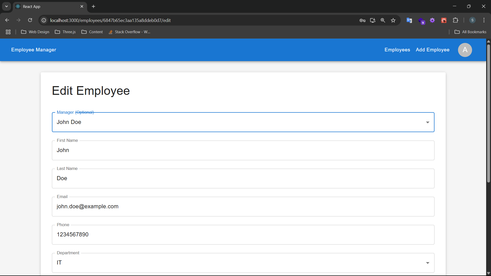
 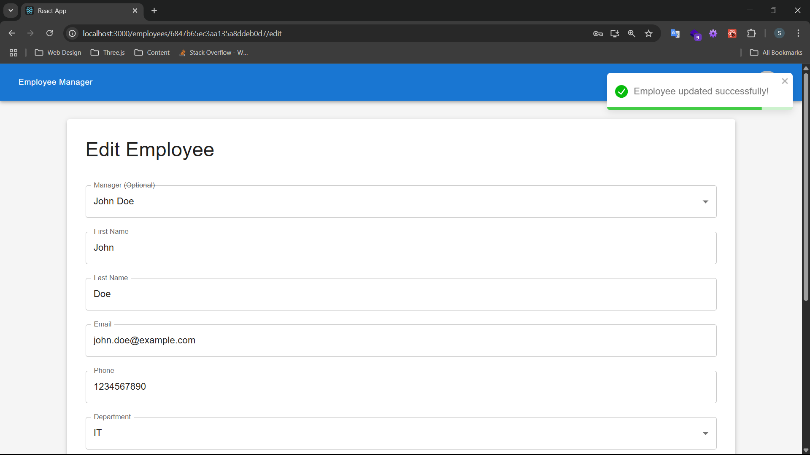
 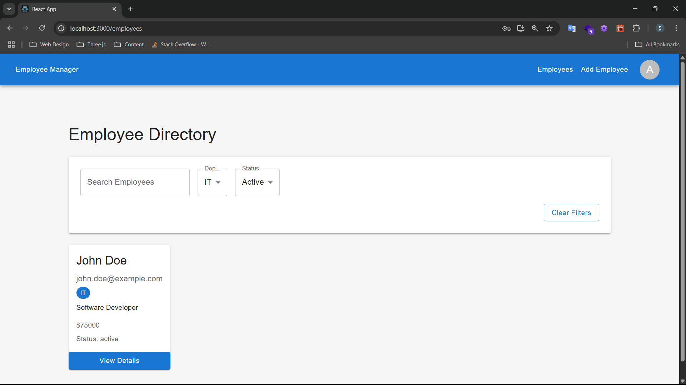

## ✨ Key Features

### 🔐 Authentication System
- User registration and login flows
- Role-based access control (user/admin)
- JWT token authentication

### 👥 Employee Management
- Complete CRUD operations
- Detailed employee profiles (personal info, department, position, salary)
- Status tracking (active/on leave/terminated)

### 🔍 Search & Filtering
- Instant search by name/email
- Department and status filters

### ✔️ Validation
- Client-side form validation
- Server-side input sanitization

### 📱 Responsive Design
- Mobile-first responsive layout
- Material-UI components

## 🛠️ Technology Stack
- **Frontend**: React, Redux Toolkit, Material-UI
- **Backend**: Node.js, Express, MongoDB
- **Authentication**: JWT, bcrypt